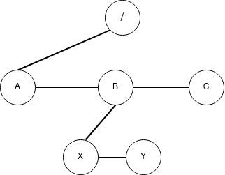

# Linux Filesystem Simulator

This project simulates the organization of the files in linux in a tree.


## Tree structure
The image below shows the structure of the file tree.



The thick lines show the connection between the parent and the child while the thin lines show connection between siblings.
Every node has a connection back to the parent.    

There are two types of nodes that are supported: Directories and Files

## Commands Present
The list of commands that can be entered
- mkdir pathname: create a directory
- rmdir pathname: delete a directory
- cd [pathname]: change to a directory
- ls [pathname]: list the contents of the directory
- pwd: present working directory
- touch: create a file
- rm: delete a file
- menu: display the list of commands
- quit
## Run Locally

Clone the project

```bash
  git clone https://github.com/harsha-vardhan-v/linux-filesystem-simulator.git
```

Go to the project directory

```bash
  cd linux-filesystem-simulator
```

Compile the project

```bash
  mkdir bin obj
  make all
```

Run the binary file

```bash
  ./bin/fileSystem
```


## Source
This project is done by following the instructions in the book **Systems programming in unix/linux** by **K.C. Wang**.